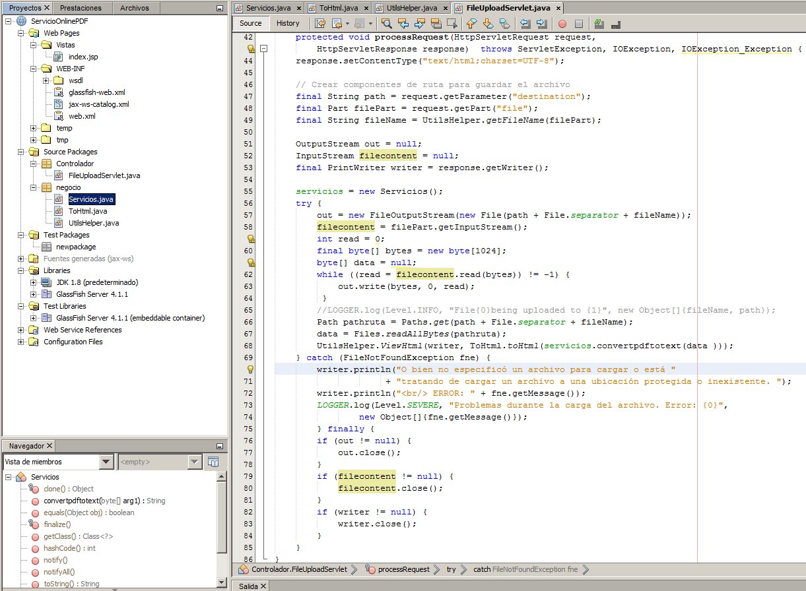
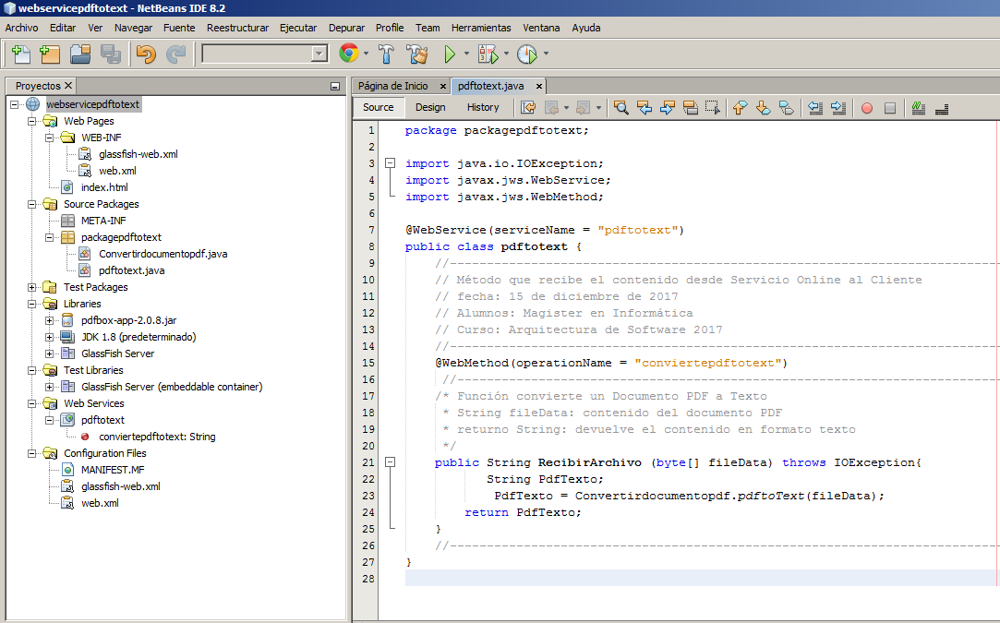

===================
Implementacion and Testing
===================

Implementación:

El producto de software se desarrollo bajo una Metodología de Arquitectura ad-hoc, y un Modelo de Prototipos.

* Servicio Online: Página Web Cliente

	Lenguaje de Programación Java, en un entorno IDE Netbeans 8.2.

	Servidor GlassFish 5.0
	
	Url: http://env-2198266.jelastic.saveincloud.net/

	
* Componente Clound: Web Service

   	Lenguaje de Programación Java, en un entorno IDE Netbeans 8.2.

	Servidor GlassFish 5.0
	
	Url WSDL: http://env-6829647.jelastic.saveincloud.net/pdftotext?WSDL
	
	Url Web Service: http://env-6829647.jelastic.saveincloud.net/

	
* Testing:

Casos de Prueba

+----------------------------+-----------------------+-------------------------+------------------------+-------------+------------------------------+
| Casos de Prueba            | Responsable           | Area Funcional          | Funcionalidad          | Fecha       | Resultado                    |
+============================+=======================+=========================+========================+=============+==============================+
| Prueba enviar              | Alumnos               | Enviar y Recibir        | Enviar Contenido  al   | 21/21/2017  | Satisfactorio                |
| contenido al Web Service   |                       | Contenido               | Web Service            |             |                              |
+----------------------------+-----------------------+-------------------------+------------------------+-------------+------------------------------+
| Prueba recibir             | Alumnos               | Enviar y Recibir        | Recibir Contenido del  | 21/21/2017  | Satisfactorio                |
| contenido del Web Service  |                       | Contenido               | Web Service            |             |                              |
+----------------------------+-----------------------+-------------------------+------------------------+-------------+------------------------------+
| Subir documento pdf        | Alumnos               | Procesar Documento      | Subir documento y leer | 21/21/2017  | Satisfactorio                |
|                            |                       |                         | contenido              |             |                              |
+----------------------------+-----------------------+-------------------------+------------------------+-------------+------------------------------+
| Procesar documento pdf     | Alumnos               | Procesar Documento      | Mostrar Contenido      | 21/21/2017  | Satisfactorio                |
|                            |                       |                         | como texto             |             |                              |
+----------------------------+-----------------------+-------------------------+------------------------+-------------+------------------------------+
